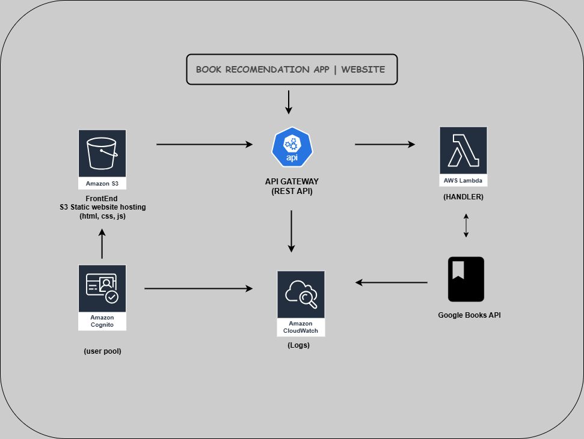

# 📚 Book Recommendation Web App

An interactive book discovery platform powered by **Google Books API**, built using **HTML, CSS, and JavaScript**, and designed for deployment via **GitHub Pages** or **AWS Cloud Infrastructure** (S3, Lambda, API Gateway, Cognito, CloudWatch). The app lets users search, filter, and explore books by genres, ratings, and page count, all wrapped in a clean, theme-toggleable UI.

## 🔧 Architecture Overview



### 🔹 Tech Stack

- **Frontend:** HTML, CSS, JavaScript (deployable on **GitHub Pages** or **Amazon S3**)
- **Authentication (Optional):** **Amazon Cognito** (user pool)
- **Backend:** **AWS Lambda** function (Node.js handler)
- **API Management:** **Amazon API Gateway** (REST API)
- **Logging & Monitoring:** **Amazon CloudWatch**
- **Book Data Source:** **Google Books API**

---

## 🚀 Deployment Instructions

### 📁 1. Folder Structure

```
├── index.html
├── app.js
├── lambda/
│   └── lambda_function.zip  # Your zipped Lambda handler
```

---

### 2. Setup Options

#### 📲 A. Deploy via GitHub Pages
1. Push your project to a GitHub repository.
2. Go to your repository settings.
3. Scroll to **Pages**.
4. Under "Source", choose `main` branch and `/ (root)`.
5. Save and wait a few minutes.
6. Your site will be live at: `https://<username>.github.io/<repository-name>/`

Make sure:
- `index.html` and `app.js` are in the root of the repo.
- The `API_ENDPOINT` in `app.js` is correct and publicly accessible.

#### 🗂️ B. Deploy Frontend to S3 (Optional)
1. Create an S3 bucket and enable **Static Website Hosting**.
2. Upload:
   - `index.html`
   - `app.js`
3. Set permissions for public read access (or use CloudFront).
4. Update the `API_ENDPOINT` in `app.js`.

#### ⚙️ C. Set Up AWS Lambda
1. Go to **AWS Lambda**, create a function.
2. Upload `lambda_function.zip`.
3. Set handler (`index.handler`) and runtime (`Node.js`).
4. Grant permissions for Internet and CloudWatch.

#### 🌐 D. Configure REST API Gateway
1. Create REST API.
2. Add `/recommendations` endpoint with `GET` method.
3. Link to your Lambda function.
4. Enable CORS.
5. Deploy and get the public endpoint.

#### 🧐 E. Add Cognito Auth (Optional)
- Create a User Pool.
- Set up Cognito Authorizer in API Gateway.
- Protect endpoints.

---

## 🌍 Live Demo

You can deploy this app on **GitHub Pages** at no cost, or use **AWS services** for more control and scalability.

---

## 🛆 API Reference

### `GET /recommendations`

Returns a list of books recommended from the Google Books API.

```json
{
  "books": [
    {
      "id": "123",
      "title": "Clean Code",
      "author": "Robert C. Martin",
      "genre": "Programming",
      "rating": 4.7,
      "pageCount": 464,
      "description": "...",
      "image": "https://...",
      "purchaseLink": "https://...",
      "price": "$30.99"
    },
    ...
  ]
}
```

---

## 🛡 Security Considerations

- For AWS deployments, isolate API access via **API Gateway**.
- Use **Cognito** for secure user sessions.
- Monitor usage via **CloudWatch**.
- Use **least privilege** on IAM roles.

---

## 👨‍💻 Author

**Obidiegwu Onyedikachi Henry Leonard**  
Cloud Security Architect | DevSecOps Engineer  
🔗 [GitHub](https://github.com/LeonardKachi) • [Portfolio](https://leonardkachi.github.io/Portfolio-website) • 📧 Henryleo480@gmail.com

---

## 📜 License

MIT — feel free to fork and improve!


